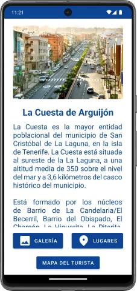
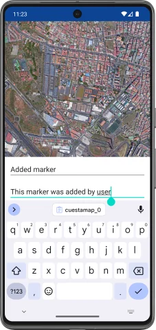

# Map

**Map** is an application that shows the place where I grew up. It has markers
at important places and the possibility to add new markers.

The project was built using **Kotlin** in **Android Studio** and
**Google Maps API**.

> [!NOTE]  
This application was developed during my time as a student, under a tight
deadline and while managing other projects. It offers the core functionality,
but you may encounter bugs, rough edges, and code that’s not production-ready.

# Media

  
  
  
  
  
  

